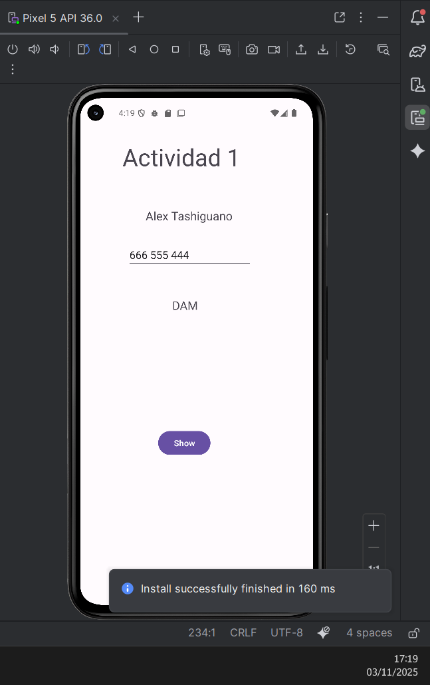

## PRACTICA DE MOVILES

### MAIN ACTIVITIY 1
```kotlin
package com.example.navegar_alextashiguano

import android.os.Bundle
import androidx.activity.enableEdgeToEdge
import androidx.appcompat.app.AppCompatActivity
import androidx.core.view.ViewCompat
import androidx.core.view.WindowInsetsCompat
import android.widget.Button
import android.content.Intent
import android.widget.EditText
import android.widget.TextView
import android.provider.ContactsContract.CommonDataKinds.Phone

class MainActivity : AppCompatActivity() {
    override fun onCreate(savedInstanceState: Bundle?) {
        super.onCreate(savedInstanceState)
        enableEdgeToEdge()
        setContentView(R.layout.activity_main)
        val txtNombre = findViewById<TextView>(R.id.txtNombre)
        val txtCurso = findViewById<TextView>(R.id.txtCurso)
        val txtTelefono = findViewById<EditText>(R.id.txtTelefono)

        val boton:Button = findViewById(R.id.btnIr)
        boton.setOnClickListener { view ->
            val intent = Intent(this, MainActivity2::class.java);
            intent.putExtra("id", "usuario123");
            intent.putExtra("edad", 42);
            intent.putExtra("localidad", "Parla");

            val nombre = txtNombre.text.toString()
            val curso = txtCurso.text.toString()
            val telefono = txtTelefono.text.toString()

            intent.putExtra("nombre", nombre)
            intent.putExtra("curso", curso)
            intent.putExtra("telefono", telefono)
            startActivity(intent);

        }
        }
    }
```

### MAIN ACTIVITY 2
```kotlin
package com.example.navegar_alextashiguano

import android.os.Bundle
import android.widget.EditText
import android.widget.TextView
import androidx.activity.enableEdgeToEdge
import androidx.appcompat.app.AppCompatActivity
import androidx.core.view.ViewCompat
import androidx.core.view.WindowInsetsCompat
import android.widget.Toast
import org.w3c.dom.Text

class MainActivity2 : AppCompatActivity() {
    override fun onCreate(savedInstanceState: Bundle?) {
        super.onCreate(savedInstanceState)
        enableEdgeToEdge()
        setContentView(R.layout.activity_main2)

        val txtNombre1 = findViewById<TextView>(R.id.txtnombre1)
        val txtCurso1 = findViewById<TextView>(R.id.txtcurso1)
        val txtTelefono1 = findViewById<TextView>(R.id.txtTelefono1)

        val nombre = intent.getStringExtra("nombre")
        val curso = intent.getStringExtra("curso")
        val telefono = intent.getStringExtra("telefono")

        txtNombre1.text = nombre
        txtCurso1.text = curso
        txtTelefono1.text = telefono

        

        val extras = intent.extras
        val usuario = extras!!.getString("id")
        val edad = extras!!.getInt("edad")
        val localidad = extras!!.getString("localidad")

        val msg = "$usuario $edad $localidad"

        val toast = Toast.makeText(this, msg, Toast.LENGTH_LONG)
        toast.show()

    }
    }
``` 
### LAYOUT

#### activity_main

```xml
<?xml version="1.0" encoding="utf-8"?>
<androidx.constraintlayout.widget.ConstraintLayout xmlns:android="http://schemas.android.com/apk/res/android"
    xmlns:app="http://schemas.android.com/apk/res-auto"
    xmlns:tools="http://schemas.android.com/tools"
    android:id="@+id/main"
    android:layout_width="match_parent"
    android:layout_height="match_parent"
    tools:context=".MainActivity">

    <TextView
        android:id="@+id/txtTitulo"
        android:layout_width="216dp"
        android:layout_height="72dp"
        android:layout_marginStart="72dp"
        android:layout_marginTop="72dp"
        android:text="@string/Titulo"
        android:textSize="40sp"
        app:layout_constraintStart_toStartOf="parent"
        app:layout_constraintTop_toTopOf="parent"
        tools:ignore="TextSizeCheck" />

    <Button
        android:id="@+id/btnIr"
        android:layout_width="wrap_content"
        android:layout_height="wrap_content"
        android:layout_marginStart="132dp"
        android:layout_marginBottom="248dp"
        android:text="@string/Show"
        app:layout_constraintBottom_toBottomOf="parent"
        app:layout_constraintStart_toStartOf="parent" />

    <TextView
        android:id="@+id/txtNombre"
        android:layout_width="162dp"
        android:layout_height="29dp"
        android:layout_marginStart="114dp"
        android:layout_marginTop="40dp"
        android:layout_marginEnd="239dp"
        android:text="Alex Tashiguano"
        android:textSize="20dp"
        app:layout_constraintEnd_toEndOf="parent"
        app:layout_constraintHorizontal_bias="0.028"
        app:layout_constraintStart_toStartOf="parent"
        app:layout_constraintTop_toBottomOf="@+id/txtTitulo" />

    <TextView
        android:id="@+id/txtCurso"
        android:layout_width="wrap_content"
        android:layout_height="wrap_content"
        android:layout_marginTop="48dp"
        android:text="DAM"
        android:textSize="20dp"
        app:layout_constraintEnd_toEndOf="parent"
        app:layout_constraintHorizontal_bias="0.446"
        app:layout_constraintStart_toStartOf="parent"
        app:layout_constraintTop_toBottomOf="@+id/txtTelefono" />

    <EditText
        android:id="@+id/txtTelefono"
        android:layout_width="wrap_content"
        android:layout_height="wrap_content"
        android:layout_marginTop="28dp"
        android:ems="10"
        android:inputType="phone"
        android:text="666 555 444"
        app:layout_constraintEnd_toEndOf="parent"
        app:layout_constraintHorizontal_bias="0.437"
        app:layout_constraintStart_toStartOf="parent"
        app:layout_constraintTop_toBottomOf="@+id/txtNombre" />

</androidx.constraintlayout.widget.ConstraintLayout>
``` 
#### activity_main2

```xml
<?xml version="1.0" encoding="utf-8"?>
<androidx.constraintlayout.widget.ConstraintLayout xmlns:android="http://schemas.android.com/apk/res/android"
    xmlns:app="http://schemas.android.com/apk/res-auto"
    xmlns:tools="http://schemas.android.com/tools"
    android:id="@+id/main"
    android:layout_width="match_parent"
    android:layout_height="match_parent"
    tools:context=".MainActivity2">

    <TextView
        android:id="@+id/txtnombre1"
        android:layout_width="wrap_content"
        android:layout_height="wrap_content"
        android:layout_marginTop="48dp"
        android:text="TextView"
        app:layout_constraintEnd_toEndOf="parent"
        app:layout_constraintHorizontal_bias="0.498"
        app:layout_constraintStart_toStartOf="parent"
        app:layout_constraintTop_toBottomOf="@+id/btnTitulo2" />

    <TextView
        android:id="@+id/btnTitulo2"
        android:layout_width="174dp"
        android:layout_height="59dp"
        android:layout_marginTop="101dp"
        android:text="@string/Titulo2"
        android:textSize="30sp"
        app:layout_constraintEnd_toEndOf="parent"
        app:layout_constraintStart_toStartOf="parent"
        app:layout_constraintTop_toTopOf="parent" />

    <TextView
        android:id="@+id/txtcurso1"
        android:layout_width="wrap_content"
        android:layout_height="wrap_content"
        android:layout_marginTop="20dp"
        android:text="TextView"
        app:layout_constraintEnd_toEndOf="parent"
        app:layout_constraintHorizontal_bias="0.498"
        app:layout_constraintStart_toStartOf="parent"
        app:layout_constraintTop_toBottomOf="@+id/txtnombre1" />

    <EditText
        android:id="@+id/txtTelefono1"
        android:layout_width="wrap_content"
        android:layout_height="wrap_content"
        android:layout_marginTop="20dp"
        android:ems="10"
        android:inputType="phone"
        app:layout_constraintEnd_toEndOf="parent"
        app:layout_constraintHorizontal_bias="0.497"
        app:layout_constraintStart_toStartOf="parent"
        app:layout_constraintTop_toBottomOf="@+id/txtcurso1" />
</androidx.constraintlayout.widget.ConstraintLayout>
``` 

### Imagenes de ejecucion

#### Imagenes de la pantalla 1


#### Imagen de la pantalla2
